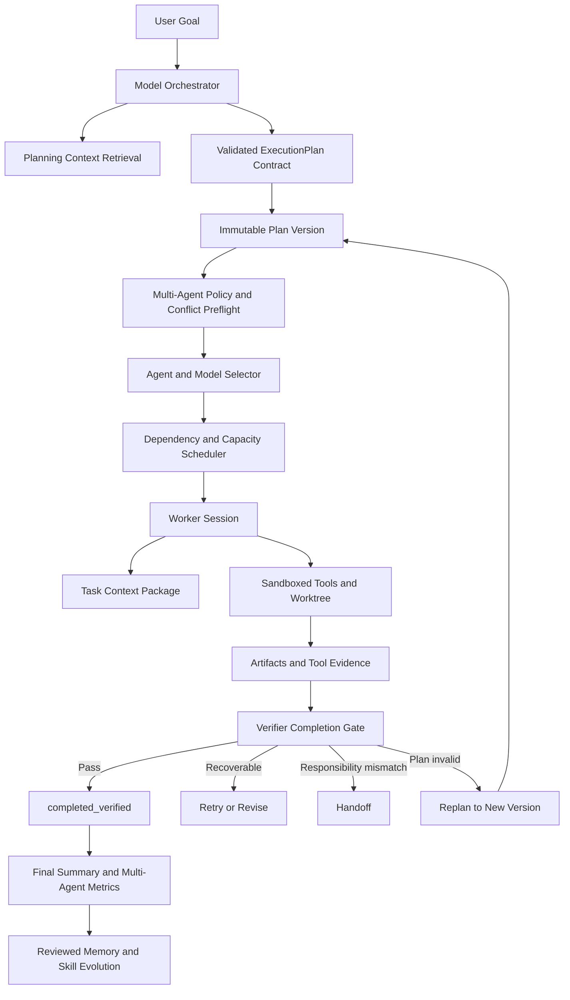

# ModelGate Agent Studio P0–P2 完整开发 Review

> Review 日期：2026-07-18  
> Review 范围：`2026-07-18-Plan-and-Execute主架构与按需Multi-Agent-RAG开发计划.md` 的 P0、P1、P2 全部开发内容  
> Review 对象：当前本地工作区代码、数据库迁移、API、前端页面、自动化测试和生产构建  
> 当前状态：开发内容已落地且仓库级自动化验收通过；变更仍在本地工作区，尚未提交 Git

---

## 1. Review 结论

### 1.1 总体判断

本轮开发已经把 ModelGate Agent Studio 从“以固定角色和界面流程为主的 Multi-Agent 原型”，推进为一套以真实执行状态为核心的 Plan-and-Execute Agent Runtime：

- Goal 会先产生可校验、可版本化的 ExecutionPlan。
- Task Graph 由依赖、能力、风险、完成条件和并行政策驱动。
- Runtime 只执行当前激活 Plan 中满足条件的 Task。
- Worker 使用受限 Workspace、工具、Context Package 和模型完成任务。
- Verifier 依据 Artifact、Tool Call 和 Verification Evidence 决定是否完成。
- 失败会根据证据进入 Retry、Handoff、Revise 或 Replan，而不是统一伪装成“换 Agent”。
- Multi-Agent 不再是固定团队演出，而是由能力差异、独立验收、风险和并行收益按需启用。
- RAG 成为共享、可审计、可禁用的上下文层，而不是每个 Agent 各自维护一套不透明知识库。

从仓库实现和自动化验证看，路线图中的 P0–P2 已全部完成。

### 1.2 Blunt Review

| 判断维度 | 结论 |
|---|---|
| 路线图代码完成度 | **完成**。P0、P1、P2 清单全部有代码、数据结构、API、UI 或测试证据。 |
| 仓库级质量门禁 | **通过**。后端 325 项、前端 168 项测试通过，前端生产构建和 `git diff --check` 通过。 |
| Agent 架构真实性 | **显著提升**。Plan、Runtime、Tool、Evidence、Verifier、Handoff、Replan 已形成真实控制闭环。 |
| Multi-Agent 真实性 | **达到“按需编排”目标**。Agent 数量和并行状态来自实际 Plan/Task，而不是模板或 UI 伪造。 |
| RAG 产品闭环 | **MVP 完成**。来源、同步、Chunk、检索、引用、预算、反馈和禁用链路齐全。 |
| 真实模型生产验收 | **尚未证明**。当前没有根目录、后端或前端 `.env`；最终全量回归主要证明 Mock/离线和服务逻辑。 |
| 生产数据库迁移成熟度 | **仍需加强**。当前有 SQL migration 和 SQLite 加列兼容层，但没有正式版本表与统一迁移执行器。 |
| 是否可以直接宣称生产就绪 | **不建议**。可以宣称“P0–P2 仓库开发完成”，不能直接宣称“真实 Provider 生产验收完成”。 |

因此，本轮最准确的结论是：

> **代码开发完成，仓库级验收通过；真实 Provider、正式迁移、浏览器端到端和生产并发仍是上线前门禁。**

---

## 2. 开发前后架构变化

### 2.1 开发前的主要问题

开发前系统已经具备 Agent、模型路由、Quota、Handoff、工具、Workspace 和 Review 等模块，但核心控制仍存在几个结构性问题：

1. 规划更接近关键词到固定角色流程的映射。
2. Team Template 容易被理解为固定 Agent 顺序。
3. Task 完成与真实 Artifact、测试和验证证据没有统一门禁。
4. Retry、Handoff、Revision 和 Replan 边界容易混淆。
5. Workspace 能显示多个 Agent，但不一定能证明这些 Agent 来自真实激活计划。
6. Memory/Skill 已有雏形，但缺少正式 Knowledge Source、Chunk、Retrieval Run 和 Citation 管线。
7. Multi-Agent 缺少能力选择、并发容量、冲突预检、协调成本和收益证明。

### 2.2 开发后的主架构

这条链路的核心变化不是“增加了更多 Agent”，而是建立了一个有状态、可验证、可恢复的 Runtime 控制面。

---

## 3. P0：Plan-and-Execute 主闭环 Review

### 3.1 ExecutionPlan、PlanTask 和 PlanChange

已新增不可变 Plan Version 体系，核心数据包括：

- `ExecutionPlan`：保存 plan_id、version、状态、task_mode、目标摘要、激活理由、规划来源、原始输出、修复记录和成本估计。
- `PlanTask`：保存任务目标、类型、能力、工具、依赖、验收条件、风险、审批要求、并行安全、Workspace Scope 和合并策略。
- `PlanChange`：保存 Replan 的原因、证据、保留/取消/新增/替换 Task，以及前后版本关联。
- Runtime `Task` 保存 `plan_version_id`、`plan_task_id`、`plan_source`，保证执行记录可以回溯到计划版本。

相关实现：

- `backend/src/models/workspace.py`
- `backend/src/schemas/planning.py`
- `backend/src/services/planning_service.py`
- `backend/migrations/013_create_execution_plans.sql`

Review 结论：Plan 不再只是 Runtime 前的临时 JSON，而是正式、可审计的领域对象。

### 3.2 结构化规划与 Rule Fallback

`ModelOrchestrator` 使用 Planner 的可用模型生成结构化计划，规划输入包含：

- Goal 和完成定义。
- Team capability/policy。
- 可用 Agent、模型、工具和预算。
- 初始 Knowledge Context。
- 风险与审批约束。

模型输出最多进行三次 JSON/Schema 修复。模型、Provider、能力或工具不可用时，会显式记录并进入 `RuleBasedPlanningFallback`，而不是把规则规划伪装成模型决策。

计划校验覆盖：

- 重复 Task ID。
- 悬空依赖。
- DAG 循环。
- 写任务缺少完成条件。
- 并行写冲突缺少隔离/合并策略。
- 高风险任务缺少审批或独立 Reviewer。

Review 结论：模型规划和规则降级已经有清晰边界，错误计划不能直接进入 Runtime。

### 3.3 Scheduler 与动态任务图

Scheduler 已支持：

- `pending / ready / assigned / running / waiting_approval / skipped / cancelled / blocked` 等运行状态。
- 依赖完成后动态进入 Ready。
- Goal 级 `max_parallel_tasks`。
- Agent 级 `max_concurrency`。
- 无 Ready Task 时输出明确阻塞原因。
- Pause、Resume、Stop 不破坏 Plan 状态。
- Replan 后只调度当前激活版本。
- 保留已经验证完成且仍然有效的 Task，避免重复执行。

相关实现：

- `backend/src/services/scheduler_service.py`
- `backend/migrations/014_add_scheduler_policy.sql`
- `backend/tests/test_scheduler_service.py`

Review 结论：Runtime 已从“循环执行任务列表”升级为依赖和容量驱动的调度器。

### 3.4 统一 Runtime Decision 与 Replan

系统现在使用统一决策契约表达：

- `complete`
- `revise_current_task`
- `replan_graph`
- `handoff`
- `ask_user`
- `blocked`

触发源包括工具失败、Provider 失败、验证失败、合并冲突、预算耗尽、用户修改和 Handoff 上下文不一致。

Replan 会：

1. 基于当前激活版本构建新 Plan Contract。
2. 保存触发原因、失败证据和 Replan Context。
3. 区分 retained、cancelled、added、replaced Task。
4. 创建不可变新版本。
5. 重新物化需要执行的 Runtime Task。
6. 将旧版本标记为 superseded，新版本标记为 active。

兼容旧 Runtime Task 图时，会从原任务类型和已分配 Agent 角色恢复能力语义，避免把旧 Coder 任务误判成 `direct`。

Review 结论：失败恢复已经从“追加一条 Replan 文本任务”升级为真正的任务图版本变更。

### 3.5 Verifier Completion Gate

代码和确定性任务不能仅凭模型输出进入成功状态。Completion Gate 会检查：

- Worker 是否有输出。
- 必需 Artifact 是否存在。
- Completion Contract 是否满足。
- VerificationResult 是否全部通过。
- 高风险审批是否完成。
- 是否存在要求独立验证的下游 Task。

已支持的验收规则包括：

- `diff_exists`
- `tests_pass`
- `lint_pass`
- `typecheck_pass`
- `build_pass`
- `file_exists`
- `command_exit_code`
- `user_approval`

只有证据成立时，Task 才能进入 `completed_verified`。证据不足则进入 `completed_unverified`、`revision_required`、`waiting_approval` 或 `blocked`，Goal 不能被错误提升为完成。

Review 结论：这是本轮“真正 Agent 化”最重要的质量门禁之一。

### 3.6 Workspace 作为 Runtime 真相界面

Workspace State 现在统一返回：

- 当前激活 Plan 和历史版本。
- task_mode 和 activation_reason。
- Task edges、parallel groups 和动态 Agent。
- Replan events 和 Plan Diff。
- Completion evidence。
- Context runs 和 citations。
- Agent/model selection decisions。
- Multi-Agent metrics。

Plan 区支持确认、修改 Task 后生成新版本，以及把并行计划降级为串行。Card Flow 和 Pixel Office 通过同一个 Workspace ViewModel 渲染，只展示实际激活的 Task/Agent。

Review 结论：Workspace 已成为主产品入口和 Runtime 解释层，不再只是多个模块的展示集合。

---

## 4. P1：共享 RAG Review

### 4.1 数据模型与迁移

新增：

- `KnowledgeSource`
- `KnowledgeDocument`
- `KnowledgeChunk`
- `RetrievalRun`
- `RetrievedContextItem`
- `ContextPackageSnapshot`

数据设计包含：

- `(source_id, path)` 唯一约束，保证 Source 内文档幂等。
- `(document_id, chunk_index)` 唯一约束，保证 Chunk 顺序唯一。
- `(retrieval_run_id, rank)` 唯一约束，保证检索证据排序稳定。
- Goal、Task、Agent、Source、Document、Chunk 和状态字段的必要索引。
- 文档列表聚合统计 Chunk，移除了随文档数量增长的 N+1 查询。

相关实现：

- `backend/src/models/knowledge.py`
- `backend/migrations/015_create_knowledge_retrieval.sql`
- `backend/tests/test_knowledge_models.py`

Review 结论：RAG 已经具备可持续扩展的数据底座，而不是只在 Prompt 中临时拼接文本。

### 4.2 Knowledge Source 同步

Knowledge Source 支持：

- 连接 Workspace 内目录或单个文档。
- Workspace Root 和 Source Scope 权限校验。
- 文本类型白名单。
- 忽略隐藏目录、构建目录和超限文件。
- Checksum 增量同步。
- 区分新增、更新、未变化和删除。
- 更新时事务内批量重建 Chunk。
- 删除时软禁用 Document/Chunk，保留审计历史。
- 查看同步状态、更新时间和错误。
- 禁用错误 Source 后重新运行。

Review 结论：知识同步已形成可管理的数据生命周期。

### 4.3 混合检索、预算和引用

当前默认检索策略为 `hybrid_keyword_hash_embedding_v1`，综合：

- 关键词重合。
- 本地 Hash Embedding 余弦相似度。
- 文件路径命中加分。
- 精确短语加分。
- 稳定排序和轻量 Rerank。

检索会保存：

- Query、Policy 和过滤条件。
- 每个候选的 rank、score、used、citation 和 token_count。
- Context Budget 内实际注入的 Chunk。
- 被预算裁掉但仍保留审计记录的候选。
- 检索延迟和空结果状态。

Review 结论：当前实现适合离线、可重复的 MVP 验证，但 Hash Embedding 不是生产级语义向量模型，后续可通过 `EmbeddingAdapter` 替换。

### 4.4 RAG 在执行链路中的位置

RAG 已接入三个关键阶段：

1. Orchestrator 规划前：低预算检索 Goal 相关知识。
2. Worker 执行前：按 Task capability 和 context query 检索任务上下文。
3. Verifier/Replan：检索验收规则、历史失败、Verification Evidence 和已批准 Skill。

无活跃 Source、无相关结果、关闭 RAG 或 simple direct 场景不会被强制注入无关内容。

Review 结论：RAG 是受 Policy 和 Budget 控制的共享上下文层，没有替代 Workspace 文件工具、Git、测试和真实证据。

### 4.5 Memory/Skill 治理

治理链路包括：

- Memory/Skill 先形成 Draft。
- 只有审核通过后才进入共享上下文。
- rejected、expired、disabled 内容不会被重新检索。
- 最终验证结果会反馈 Skill 成功/失败次数和最后使用时间。
- Context Snapshot 保留实际加载内容和来源。

Review 结论：经验沉淀具备最小的人审和追溯边界，降低错误经验长期污染的问题。

### 4.6 RAG 前端闭环

Evolution Review 已加入 Knowledge Sources 管理：

- 连接 Source。
- 执行同步。
- 查看 Scope、更新时间、状态和错误。
- 展开 Document 和 Chunk。
- 禁用错误 Source。

Workspace Context Tab 显示：

- Query 和 Retrieval Policy。
- Latency 和 Token Budget。
- 候选、Score 和 Citation。
- `Injected / Dropped` 决策。

Review 结论：用户可以看到 Agent 为什么获得这段 Context，而不是只能看到模型最终输出。

---

## 5. P2：按需 Multi-Agent Review

### 5.1 Capability Registry

Agent 现在可以声明：

- capabilities 和熟练度。
- 主模型和备用模型。
- 允许工具。
- Workspace 权限模式。
- 输入/输出类型。
- 最大并发、Token、步骤和失败阈值。
- 历史成功/失败次数、平均 Token、耗时和成本。

默认 capability 包括：

`planning`、`research`、`code_read`、`code_edit`、`test`、`review`、`security_review`、`document_write`、`data_analysis`、`tool_orchestration`、`supervision` 和 `direct`。

旧 Agent 若没有显式 profile，会使用角色默认能力和工具政策保持兼容；新建 Agent 的显式配置执行严格能力过滤。

相关实现：

- `backend/src/services/capability_registry_service.py`
- `backend/src/models/agent.py`
- `backend/migrations/016_add_capability_registry.sql`
- `frontend/src/components/AgentConfigForm.tsx`
- `frontend/src/components/AgentList.tsx`

Review 结论：Agent 选择已从 role label 升级为可配置能力注册表。

### 5.2 Agent/Model 联合选择

Selector 先执行硬过滤：

- capability 熟练度。
- required tools。
- Workspace Scope。
- 输入/输出类型。
- Agent 并发容量。
- 模型启用状态。
- Context Window。
- Quota 状态。

再按以下维度评分：

- 能力匹配。
- 模型任务适配。
- 工具适配。
- Context fit。
- 历史成功率。
- 成本和延迟。
- Quota。
- 风险政策。
- 当前负载。

每次决策持久化：

- 全部候选。
- 每个候选的淘汰原因。
- score breakdown。
- 最终 Agent 和模型。
- 备用模型。
- 后备 Agent。
- Handoff 是否可用和原因。

Review 结论：选择过程可解释、可回放，不再是不可见的角色映射。

### 5.3 Team Template 改造

Team Template 现在表达的是能力集合和执行政策，而不是固定箭头流程。核心政策包括：

- `preferSingleAgent`
- `maxParallelTasks`
- `independentReview`
- `isolatedWorktrees`

Rule Fallback 不再根据模板直接生成固定角色任务。简单 Goal 即使选择了复杂团队模板，也可以保持 direct 或单 Agent；真正需要研究、编码、验证或风险审查时才激活对应能力。

Review 结论：模板现在是约束和偏好，不是对 Runtime 结果的预演。

### 5.4 并行安全、容量与降级

并行链路已具备：

- 静态检查 distinct capabilities 和独立验收条件。
- 分析并行 writer 的 Workspace Scope。
- 预检潜在文件冲突。
- 强制隔离 worktree。
- 确定性合并顺序。
- Agent `max_concurrency` 容量预留。
- 尽量把并行分支分配给不同且可用的 Agent。
- 容量不足时显式降级为 `sequential_multi_agent`。
- 不允许 UI 或计划继续显示无法执行的伪并行。

真实合并冲突会进入 Runtime Decision，创建带来源任务、冲突证据和验收条件的 Resolution Replan/Task。

Review 结论：并行从“同时启动多个 Worker”升级为带隔离、容量、合并和失败恢复的安全执行策略。

### 5.5 Retry、Handoff、Revise、Replan 边界

| 动作 | 适用场景 | Plan | Worker/责任主体 |
|---|---|---|---|
| Retry | 瞬时错误或可恢复工具失败 | 不变 | 通常不变 |
| Handoff | Agent、模型、能力、工具或 Quota 不适合 | 通常不变 | 更换并继承上下文 |
| Revise | 当前 Task 输出不合格但目标仍正确 | 局部修订 | 可保持或更换 |
| Replan | 假设、依赖、范围或任务图错误 | 创建新版本 | 按新计划重新选择 |

Handoff 会保留 Context、Workspace Scope 和 Evidence；Replan 不会重复执行仍然有效的已验证 Task。

Review 结论：恢复动作已经具备不同语义和不同状态变化，不再全部用 Handoff 表达。

### 5.6 Supervisor 按需启用

Supervisor Policy 会在以下情况启用：

- 高风险任务。
- 多个并行分支。
- 失败或重试。
- Handoff 或 Replan。
- 用户要求独立审查。
- 主观验收条件。

低风险且完全由确定性 Verification 覆盖的任务会显式记录 `supervisor.skipped`，避免每个 Goal 固定增加一次模型调用和协调成本。

Review 结论：Supervisor 已从固定结尾角色变为风险与复杂度驱动的治理能力。

### 5.7 Multi-Agent 指标与三模式基准

系统现可统计：

- task_mode 和激活原因。
- 已激活/当前活跃 Agent 数。
- 当前并行度。
- 协调 Task 数。
- 协调 Token、生产 Token 和协调 Token 比例。
- 协调耗时。
- 并行 Task 串行基线。
- 并行观测估算。
- 潜在并行节省。
- 扣除协调成本后的净时间收益。

同一组已记录 Task 会生成三种比较口径：

- single-agent：只计生产任务的 duration/token。
- sequential multi-agent：全部任务按串行累加。
- parallel multi-agent：parallel-safe Task duration 折叠为最大值，其余保持串行。

固定基准测试验证：

- 并行分支串行基线：1800ms。
- 并行估算：1000ms。
- 潜在节省：800ms。
- 协调耗时：400ms。
- 净收益：400ms。

必须强调：这是基于同次运行记录的反事实估算，不是真实重复运行的 A/B Benchmark。当前实现已经做到不伪造收益，但生产性能结论仍需要真实任务重放。

Review 结论：Multi-Agent 是否值得启用首次拥有了可见、可比较的成本收益数据。

---

## 6. 前端开发 Review

### 6.1 Studio 和 Team Template

已完成：

- 展示 capability pool。
- 展示 prefer single、最大并行、独立 Review 和 isolated worktree 政策。
- 移除固定 Agent 箭头链的产品承诺。
- Goal 输入区说明执行模式由系统按最小安全团队决定。

### 6.2 Workspace

已完成：

- Plan Overview：模式、版本、来源、激活理由、Plan Diff、Replan 和 Completion Gate。
- Task Detail：Context、Tools、Artifact、Verification、History 和 Selection Decision。
- Card Flow：来自实际 Task Graph 的分支、汇合、Handoff 和 Replan。
- Pixel Office：只让实际激活 Agent 进入工位。
- Top Status Bar：真实模式、Agent 数、并行度和协调 Token。
- Final Output：完成情况、验证状态、风险、模型、Handoff、协调成本和并行收益。
- Context Tab：检索来源、评分、引用、预算和是否注入。

### 6.3 Agent Registry 和 Evolution Review

已完成：

- Agent capability、熟练度、Scope、输入输出和最大并发配置。
- Agent 列表 capability chips 和并发信息。
- Knowledge Source 连接、同步、文档/Chunk 查看、错误和禁用操作。
- Memory/Skill 审核和使用反馈继续保留。

### 6.4 前端 Review 结论

前端已围绕 Workspace 主执行面重新组织信息，关键状态来自 Workspace API 和 Runtime，不再依赖前端自行推断“哪个 Agent 应该出现”。

但本轮最终验证是组件测试和生产构建，并未完成真实浏览器端到端视觉回归，因此响应式布局、长文本溢出、复杂分支图和 Pixel/Card 双模式切换仍需浏览器 QA。

---

## 7. API 与数据结构 Review

### 7.1 新增或强化的主要 API

| 领域 | 主要 API |
|---|---|
| Planning | `GET /goals/{goal_id}/plans`、`GET /goals/{goal_id}/plans/{version}`、`POST /goals/{goal_id}/plans/{version}/confirm`、`POST /goals/{goal_id}/replan` |
| Runtime | execute、start、execute-step、pause、resume、stop、status、events |
| Task Control | cancel、retry、skip、approve、split |
| Capability/Selection | `GET /capabilities`、`POST /router/select-agent`、`GET /goals/{goal_id}/selection-decisions` |
| Knowledge | Source create/list/sync/status、Document list、Chunk list、Context retrieve、Goal context runs |
| Handoff | create、list、detail、accept、result update |
| Agent | templates、list、detail、create、update、status |

### 7.2 数据完整性

本轮数据层做得较好的部分：

- 计划版本与 PlanTask 分离，保留不可变历史。
- Selection Decision 独立持久化，便于审计。
- Knowledge 关系使用索引和唯一约束保证幂等与查询性能。
- 同步和 Chunk 重建使用事务和批量写入。
- 文档列表使用聚合统计避免 N+1。
- SQLite 旧库通过 additive schema helper 补齐新增列。

仍需改进的部分：

- `Base.metadata.create_all()` 只能创建缺失表，不能替代正式 migration。
- `ensure_runtime_v2_schema()` 只处理 SQLite 的加列兼容，不覆盖 PostgreSQL 版本演进。
- SQL migration 目前没有统一版本表、checksum 和自动执行记录。
- 正式上线前应引入 Alembic 或等价迁移机制，并测试空库、旧库升级和回滚路径。

---

## 8. 自动化验收证据

### 8.1 最终结果

| 检查项 | 结果 |
|---|---|
| 后端 Pytest | **325 passed** |
| 前端 Vitest | **168 passed** |
| 前端生产构建 | **通过** |
| Git whitespace/error check | **`git diff --check` 通过** |
| 路线图 P0 清单 | 全部勾选 |
| 路线图 P1 清单 | 全部勾选 |
| 路线图 P2 清单 | 全部勾选 |

### 8.2 P0 六个集中验收场景

`backend/tests/test_p0_acceptance_scenarios.py` 覆盖：

1. direct 函数解释。
2. README 单句修改。
3. Coder → Verifier 登录 Bug。
4. Research → Coder → Verifier。
5. Planner → 并行前后端 → Merge → Verifier。
6. Reviewer 触发不可变新 Plan Version。

这些场景证明 direct、single、sequential 和 parallel 使用同一套 Planning Contract 与 Scheduler，而不是四套演示逻辑。

### 8.3 关键测试文件

| 能力 | 测试文件 |
|---|---|
| Plan Contract / DAG | `test_planning_contract.py` |
| Model Orchestrator | `test_model_orchestrator.py` |
| Scheduler | `test_scheduler_service.py` |
| Replan | `test_replan_protocol.py` |
| Completion Gate | `test_completion_gate.py`、`test_verification_rules.py` |
| Agent Loop | `test_verified_agent_loop.py`、`test_agent_loop_guards.py` |
| Handoff 一致性 | `test_handoff_workspace_consistency.py` |
| Knowledge/RAG | `test_knowledge_models.py`、`test_knowledge_retrieval.py` |
| Context Traceability | `test_context_memory_traceability.py` |
| Capability Selector | `test_agent_selector.py` |
| Parallel Planning | `test_parallel_planning.py` |
| Supervisor Policy | `test_supervisor_policy.py` |
| Multi-Agent Metrics | `test_multi_agent_metrics.py` |
| Workspace API | `test_workspace_api.py` |
| 前端 Plan/Task/Status/Summary | `PlanOverviewPanel.test.tsx`、`TaskDetailPanel.test.tsx`、`TopStatusBar.test.tsx`、`FinalOutputPanel.test.tsx` |

---

## 9. 开发过程中修正的关键问题

本轮不仅新增功能，也修正了几类会让系统“看起来完成但实际不正确”的问题：

1. Rule Fallback 对简单 Bug 过度激活 Planner。
2. Research 场景完成调研后遗漏实际交付 Task。
3. 并行前后端分支缺少显式 Merge。
4. README 单句修改被错误分类为 direct。
5. Final Summary 未正确统计 `completed_verified` / `completed_unverified`。
6. Knowledge Document 列表按文档逐个统计 Chunk，形成 N+1。
7. Source 同步的隐藏路径过滤使用绝对路径，可能误伤 Workspace 外层隐藏目录语义。
8. Runtime Agent 成功率曾把部分未验证/失败状态计为成功。
9. 自动 Replan 找不到合适 Agent 时，Selector 异常会覆盖原始任务失败结果。
10. 旧 Task Graph 未声明 task_type 时，Replan 会错误恢复为 `direct`，忽略已分配 Agent 的真实能力语义。
11. 只有一个并行 Agent 容量时，计划可能声明并行但无法真实并发；现在会显式降级为串行。

Review 结论：这些修正提高了状态真实性，避免 UI、最终总结和统计数据对真实 Runtime 产生误导。

---

## 10. 路线图验收矩阵

| 路线图要求 | 落地状态 | 主要证据 |
|---|---|---|
| 结构化、版本化 Plan | 完成 | Planning models/service、migration 013、planning tests |
| 模型规划 + Rule Fallback | 完成 | ModelOrchestrator、修复记录、fallback event |
| DAG/动态 Scheduler | 完成 | Scheduler、依赖/容量/阻塞测试 |
| 统一 Replan | 完成 | Runtime Decision、PlanChange、Replan tests |
| Completion Gate | 完成 | Verifier、Artifact、Verification tests |
| Workspace 真实状态 | 完成 | Workspace API、Plan/Task UI tests |
| Shared RAG 数据模型 | 完成 | Knowledge models、migration 015 |
| 增量同步 | 完成 | Checksum、soft-disable、sync tests |
| 混合检索和预算 | 完成 | Retrieval adapter、context budget tests |
| Planning/Worker/Verifier RAG | 完成 | Context service、traceability tests |
| Citation 和治理 | 完成 | RetrievalRun、Context UI、Memory/Skill feedback |
| Capability Registry | 完成 | Agent fields、registry service/API/UI |
| Agent/Model 联合评分 | 完成 | Selector、SelectionDecision、selector tests |
| Team Template 政策化 | 完成 | TeamPreset policy、Studio/Goal UI |
| 并行隔离和冲突恢复 | 完成 | Worktree、preflight、merge Resolution Task |
| 按需 Supervisor | 完成 | Supervisor Policy tests |
| Multi-Agent 成本收益 | 完成 | Metrics service、Workspace/Final Summary |
| 三模式对比口径 | 完成 | Multi-Agent benchmark test |

---

## 11. 当前已知限制与风险

### 11.1 阻止“生产就绪”结论的事项

#### A. 没有真实 Provider 全链路验收

当前检查结果：

- 根目录 `.env` 不存在。
- `backend/.env` 不存在。
- `frontend/.env` 不存在。

因此还没有证明以下真实链路：

- Planner 真实模型输出结构化 Plan。
- Worker 真实模型工具调用循环。
- Streaming、Token 和 Provider 错误语义。
- Quota/Handoff 在真实 Provider 限流下的行为。
- 多模型 fallback 的实际可用性。

建议门禁：使用至少一个真实 OpenAI-compatible Provider，在受控测试 Workspace 中跑通 direct、single、sequential、parallel、quota fallback 和 verification failure 六类场景。

#### B. 数据库迁移没有正式版本治理

虽然 013–016 migration 和 SQLite additive helper 已覆盖本轮结构，但缺少：

- migration version table。
- 自动升级顺序和执行记录。
- checksum/重复执行保护。
- PostgreSQL 升级验证。
- rollback 或前向修复流程。

建议门禁：引入 Alembic，准备“全新数据库”和“现有 012 数据库升级到 016”两套集成测试。

#### C. 没有真实浏览器端到端 QA

组件测试和 build 不能替代浏览器验证。仍需检查：

- 长 Plan 和复杂 DAG。
- 多次 Replan 的时间线。
- Handoff/Selection 大量候选时的面板可读性。
- Context Chunk 长文本。
- Pixel/Card 模式切换一致性。
- 1280px、1440px 和小屏布局。

#### D. Multi-Agent Benchmark 是估算

当前三模式比较使用同一运行记录推导，适合产品解释和守门，不足以证明真实速度提升。正式结论需要同一任务在相同模型、相同 Context、相同缓存条件下重复运行 single、sequential 和 parallel，并统计 P50/P95。

### 11.2 中期技术风险

1. 默认 Hash Embedding 语义能力有限，需要替换为生产 Embedding Provider 或本地高质量模型。
2. SQLite 适合本地 MVP，不适合高并发多 Worker 生产部署。
3. Agent 历史成功率样本量少时可能对 Selector 评分造成噪声。
4. 成本指标依赖模型价格数据；缺失时必须继续显示 unavailable，不能估造金额。
5. 静态 Workspace Scope 冲突分析不能替代运行时 Git merge 检查。
6. 并行 Worker 的进程级/容器级隔离仍弱于真正沙箱执行环境。
7. 当前未完成专项安全扫描、负载测试和故障注入测试。
8. 当前大量改动尚未形成提交，提交前仍需确认变更范围并拆分合理 commit。

---

## 12. 上线前建议门禁

### 必须完成

- [ ] 配置真实 Provider，完成六类真实 E2E Goal。
- [ ] 引入正式数据库 migration version 管理并验证旧库升级。
- [ ] 使用浏览器完成 Workspace、Plan、Context、Handoff 和双模式视觉 QA。
- [ ] 对 production build 执行 API + UI 冒烟测试。
- [ ] 完成一次安全扫描，重点检查 Workspace 路径、命令工具、Handoff Context 和 API Key。
- [ ] 执行并发与故障注入测试，覆盖模型超时、Quota、工具失败、合并冲突和进程重启。
- [ ] 整理并提交当前工作区变更，保留可回滚的 commit 边界。

### 建议完成

- [ ] 用真实 Embedding Adapter 替换默认 Hash Embedding，并对检索质量建立小型评测集。
- [ ] 对 Selector 权重做离线回放和校准。
- [ ] 建立 Plan validity、Replan rate、verification pass rate、RAG used ratio 和 Multi-Agent activation rate 仪表盘。
- [ ] 用真实 A/B 重放替代纯估算 Benchmark。
- [ ] 为大型 DAG 和长 Context 增加分页/虚拟化。

---

## 13. 最终 Go / No-Go 判断

### 对“本轮开发是否完成”

**GO。**

理由：

- P0–P2 路线图全部有实际实现。
- 关键路径都有自动化测试。
- 后端、前端和生产构建全部通过。
- 状态、证据、版本、选择、恢复和成本形成闭环。
- 路线图已回写完成证据，不存在仅勾选无实现的条目。

### 对“是否可以进入真实环境验收”

**GO，但必须以验收环境为目标，不是直接生产发布。**

代码已经具备开展真实 Provider、数据库升级、浏览器 E2E 和故障注入的基础。

### 对“是否已经生产就绪”

**NO-GO。**

主要阻塞项不是 P0–P2 功能缺失，而是：

1. 真实 Provider 全链路尚未验证。
2. 正式数据库迁移体系尚未建立。
3. 浏览器 E2E、专项安全和生产并发尚未验收。
4. 当前工作区改动尚未提交和形成发布候选版本。

---

## 14. 最终产品判断

本轮完成后，ModelGate Agent Studio 已不再只是“把几个 Agent 卡片连接起来”的 Demo。它已经具备真正 Agent Runtime 的主要骨架：

- 有计划，而不是只响应 Prompt。
- 有真实工具和 Workspace Scope，而不是只生成文本。
- 有 Artifact 和 Verification，而不是只相信模型自报完成。
- 有 Plan Version 和 Replan，而不是失败后从头再跑。
- 有 Handoff Context 继承，而不是简单换模型。
- 有共享 RAG 和 Citation，而不是无来源地塞入 Memory。
- 有 Capability Selection，而不是固定角色排班。
- 有并行隔离和协调成本，而不是用 Agent 数量制造繁忙感。
- 有 Workspace Runtime 真相源，而不是 UI 自己编故事。

最准确的产品定位可以表述为：

> **ModelGate Agent Studio 是一个以 Plan-and-Execute 为主架构、以共享 RAG 为上下文层、以按需 Multi-Agent 为执行策略，并通过工具、Artifact、Verification、Handoff 和 Replan 完成真实任务的可视化 Agent Runtime。**

下一阶段的重点不应继续堆叠角色或页面，而应把现有闭环带入真实 Provider、正式数据库和生产级验收环境，用真实任务证明可靠性、成本和收益。

---

## 15. 证据索引

### 路线图

- `docs/roadmap/2026-07-18-Plan-and-Execute主架构与按需Multi-Agent-RAG开发计划.md`

### 后端核心实现

- `backend/src/services/model_orchestrator_service.py`
- `backend/src/services/planning_service.py`
- `backend/src/services/scheduler_service.py`
- `backend/src/services/runtime_service.py`
- `backend/src/services/runtime_decision_service.py`
- `backend/src/services/replan_service.py`
- `backend/src/services/verifier_service.py`
- `backend/src/services/context_service.py`
- `backend/src/services/knowledge_source_service.py`
- `backend/src/services/retrieval_service.py`
- `backend/src/services/capability_registry_service.py`
- `backend/src/services/agent_selector_service.py`
- `backend/src/services/plan_policy_service.py`
- `backend/src/services/supervisor_policy_service.py`
- `backend/src/services/multi_agent_metrics_service.py`
- `backend/src/services/workspace_service.py`

### 前端核心实现

- `frontend/src/pages/WorkspacePage.tsx`
- `frontend/src/pages/StudioPage.tsx`
- `frontend/src/pages/AgentRegistryPage.tsx`
- `frontend/src/pages/EvolutionReviewPage.tsx`
- `frontend/src/components/PlanOverviewPanel.tsx`
- `frontend/src/components/TaskDetailPanel.tsx`
- `frontend/src/components/KnowledgeSourcesPanel.tsx`
- `frontend/src/components/TopStatusBar.tsx`
- `frontend/src/components/FinalOutputPanel.tsx`
- `frontend/src/utils/workspaceViewModel.ts`

### 数据库迁移

- `backend/migrations/013_create_execution_plans.sql`
- `backend/migrations/014_add_scheduler_policy.sql`
- `backend/migrations/015_create_knowledge_retrieval.sql`
- `backend/migrations/016_add_capability_registry.sql`

