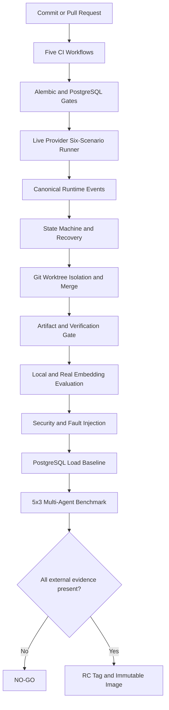

# ModelGate Agent Studio P3–P7 完整开发 Review

> Review 日期：2026-07-18  
> Review 范围：`2026-07-18-P0-P2后续真实环境验收与生产化开发计划.md` 的 P3、P4、P5、P6、P7  
> Review 对象：提交 `c2ba9a7729d8c0df64aaa9653fb0d521ee3038f1`、相关运行脚本、CI、迁移、后端、前端、测试与验收文档  
> 变更规模：153 个文件，新增 7,742 行，删除 494 行  
> 当前判定：**仓库内开发完成并通过本地门禁；真实环境与托管发布门禁未完成，RC/Production 仍为 NO-GO**

---

## 1. Review 结论

### 1.1 总体判断

本轮开发把 P0–P2 已建立的 Plan-and-Execute Runtime，从“仓库内功能闭环”继续推进到可复现、可迁移、可恢复、可审计、可压测、可进行真实 Provider 验收的生产化候选形态。

主要结果如下：

- CI 从单一工作流拆为 Backend、Frontend、Integration、Security 和 Nightly 五类门禁。
- Python、Node、npm、Playwright 和 PostgreSQL 版本被明确固定。
- Provider 配置改为环境优先，角色模型分离，API Key 不进入数据库或前端。
- OpenAI-compatible Provider 支持真实流式 Tool Call 增量重建和统一错误分类。
- Runtime 建立规范化事件协议，并持续记录 Provider request ID 与逐模型 Token usage。
- Goal、Task、Handoff、Replan、Verification 和 Worktree 进入统一状态机、事务和恢复约束。
- 数据库迁移统一到 Alembic 0001–0008，并通过空库、旧库、幂等和 PostgreSQL 专项测试。
- 浏览器 E2E、真实 Git Worktree、RAG 评测、故障注入和性能基线形成可重复执行的门禁。
- 六场景真实 Provider、真实 Embedding 和三模式 Multi-Agent Benchmark 已实现严格 runner。
- Release、回滚、Provider 安全配置、VEX 和 RC 验收文档已经补齐。

仓库内“是否做完”与生产环境“是否验收通过”必须分开判断：

> **P3–P7 的工程实现已经完成，但真实 Provider、托管 CI、Gitleaks、生产恢复演练和 15 次真实 Benchmark 没有外部证据，因此不能创建 RC Tag，也不能宣称 Production Ready。**

### 1.2 Blunt Review

| 判断维度 | 结论 |
|---|---|
| P3–P7 仓库实现 | **完成**。路线图要求的代码、脚本、工作流、测试和文档均已落地。 |
| 后端质量门禁 | **通过**。394 passed、1 skipped，覆盖率 85.91%；被跳过的 PostgreSQL 专项另行通过。 |
| 前端质量门禁 | **通过**。169 tests passed，lint 0 warning，typecheck 和 production build 通过。 |
| Browser E2E | **通过本地门禁**。四种 viewport 均执行，8 passed，12 项按设计只在主 viewport 执行一次。 |
| 数据库生产化 | **仓库侧通过**。Alembic 与 PostgreSQL 16.9 门禁成立；目标生产环境备份恢复仍待演练。 |
| Runtime 可靠性 | **显著增强**。状态机、原子事务、租约恢复、幂等、Handoff 恢复和真实 Worktree 均有测试证据。 |
| RAG 质量 | **确定性基线通过**。真实 Embedding 网络对照未执行。 |
| Multi-Agent 价值证明 | **runner 完成，结论未形成**。缺少真实 Provider、实际 Token/Cost 和 5×3 运行结果。 |
| 安全门禁 | **大部分通过**。边界、脱敏、VEX、pip/npm audit 有证据；Secret Scan 尚无正式执行结果。 |
| RC / Production | **NO-GO**。外部发布门禁未全部满足。 |

---

## 2. Review 方法与证据边界

本 Review 使用以下证据：

1. 提交 `c2ba9a7` 的实际文件范围和代码实现。
2. 路线图逐项验收状态。
3. 后端 Pytest、Coverage、Ruff、MyPy CI scope 与 PostgreSQL 专项结果。
4. 前端 Vitest、Coverage、Oxlint、TypeScript 与 Vite build 结果。
5. Playwright 四 viewport 运行结果。
6. PostgreSQL 16.9 性能与负载结果。
7. RAG 固定 30 问评测结果。
8. 依赖审计、VEX 和故障注入结果。
9. Python 3.12.8 Docker 镜像构建与 `/health` smoke。

以下项目没有被假定为通过：

- 没有真实 Provider Key 时的六场景网络运行。
- 没有真实 Embedding 模型时的语义检索网络对照。
- 没有逐模型定价和真实 usage 时的成本结论。
- 没有运行记录时的 GitHub hosted Checks、Gitleaks 和分支保护。
- 没有目标生产数据库时的备份恢复演练。

Mock、协议注入、LocalHash、未触发的 workflow 和预估成本只能证明实现存在，不能替代真实环境验收。

---

## 3. 开发前后生产化能力变化

### 3.1 开发前的主要缺口

P0–P2 完成后，核心 Agent Runtime 已经成立，但仍有以下发布级缺口：

1. CI 仍不足以证明 Python、Node、PostgreSQL 和浏览器矩阵可复现。
2. Provider 与角色模型配置没有完整的真实验收协议。
3. 流式输出和 Tool Call 之间缺少统一、可持久化的事件口径。
4. 数据库迁移仍有脚本式历史包袱，缺少正式版本治理。
5. Runtime 重启、租约、重复消费、Handoff 恢复和事务回滚证据不足。
6. Worktree 更接近接口能力，未完全证明真实 Git 生命周期和冲突恢复。
7. RAG 只有功能闭环，缺少固定数据集、质量指标和真实 Adapter 边界。
8. 安全、故障注入、负载、成本和发布退出门槛没有形成统一证据包。

### 3.2 开发后的生产化链路

链路中的仓库实现已经存在；当前停在 `All external evidence present? = No`，而不是停在代码尚未开发。

---

## 4. P3：CI 与可复现环境 Review

### 4.1 工作流拆分

已新增或重构：

- `.github/workflows/backend-ci.yml`
- `.github/workflows/frontend-ci.yml`
- `.github/workflows/integration-ci.yml`
- `.github/workflows/security-ci.yml`
- `.github/workflows/nightly-ci.yml`

职责边界清晰：

- Backend：依赖安装、Ruff、MyPy 指定范围、Pytest、Coverage 和证据上传。
- Frontend：npm 锁定安装、lint、typecheck、Vitest coverage、build 和证据上传。
- Integration：PostgreSQL、迁移与集成测试。
- Security：production dependency audit、VEX、Secret Scan 和安全测试。
- Nightly：slow/security、完整浏览器矩阵、真实 Provider、真实 Embedding，以及可选付费 Benchmark。

Review 结论：工作流结构已经达到生产候选所需的职责分离，且付费、需要 Secret 的任务没有混入普通 PR 基础门禁。

### 4.2 环境固定

当前固定版本包括：

- Python 3.12.8：`.python-version`
- Node 22.23.1：`.nvmrc`
- npm 10.9.8
- Playwright 1.61.1
- PostgreSQL 16.9

Docker production image 已使用 Python 3.12.8 构建并通过容器 `/health`。开发机 `.venv` 仍是 Python 3.9.6，但不再作为最终生产口径。

Review 结论：仓库已经具备可复现版本契约；最终仍需 GitHub runner 和不可变镜像 digest 形成远端证据。

### 4.3 P3 限制

工作流文件存在并能通过 YAML 解析，不等于托管 CI 已运行。只有远端 Checks、Artifact 和分支保护规则实际存在后，以下事项才能签字：

- 失败检查确实阻止合并。
- Backend、Frontend、Integration、Security 是 required checks。
- 分支必须最新、Review 已批准、conversation 已解决。
- 构建和测试证据可以从 GitHub 下载。

---

## 5. P4：真实 Provider Runtime Review

### 5.1 配置与 Secret 边界

Provider 配置已形成环境优先契约：

- `PROVIDER_API_KEY`
- `PROVIDER_BASE_URL`
- `PLANNER_MODEL_NAME`
- `WORKER_MODEL_NAME`
- `VERIFIER_MODEL_NAME`
- `EMBEDDING_MODEL_NAME`
- `PROVIDER_TIMEOUT_SECONDS`

API Key 不保存到数据库、不返回给前端、不写入报告。日志、工具输入和异常边界均有脱敏测试。

Review 结论：Secret 管理方向正确，角色模型也不再被单一默认模型模糊替代。

### 5.2 流式 Tool Call

OpenAI-compatible Provider 现在能够：

- 读取流式 content delta。
- 读取并重建分片 tool call delta。
- 校验 tool call 的 `id`、`name` 和 `arguments`。
- 保留 finish reason、usage 和 Provider request ID。
- 对非法 JSON、空响应、中断和 Provider 状态码进行明确分类。

Runtime 对有工具调用的真实 Worker 请求同样使用 streaming，不再只对纯文本输出流式化。

Review 结论：流式状态已从 UI 动画升级为真实 Provider 协议的一部分。

### 5.3 规范化事件协议

核心事件已经统一为可观测协议，包括：

- `plan.generating`
- `goal.completed`
- `task.assigned`
- `worker.started`
- `model.streaming`
- `tool.started / tool.completed / tool.failed`
- `artifact.created`
- `verification.started / passed / failed / completed_unverified`
- `task.completed_verified / task.completed_unverified`

工具执行会在实际运行前写入 `tool.started`，执行结束后写入唯一权威结果，避免旧式重复 `tool_call` 事件污染指标。

Review 结论：事件命名、时序和统计口径已经足以支持审计、恢复和 Benchmark。

### 5.4 六场景真实验收 runner

`backend/scripts/live_provider_acceptance.py` 已实现六类严格场景：

1. direct
2. single-agent 文件修改
3. Coder → Verifier
4. Research → Coder → Verifier
5. parallel Worktree
6. Replan / Handoff 恢复

runner 会：

- 为每个场景创建隔离 Git fixture。
- 拒绝 Planner rule fallback 冒充真实规划。
- 校验 Plan mode、角色、规范化事件和真实 request ID。
- 校验 ToolCallRecord、Artifact、测试、Worktree merge 和最终 Goal 状态。
- 场景 F 注入 quota Handoff，再执行 accept 和恢复。
- 保存逐 Provider 模型 Token usage、请求 ID、事件数、耗时和人工介入次数。

Review 结论：验收逻辑不是“写一份操作说明”，而是严格失败式 runner；但没有凭据时不能形成真实通过报告。

---

## 6. P5：数据库迁移与状态可靠性 Review

### 6.1 Alembic 0001–0008

已建立正式 Alembic 迁移链：

1. `0001_schema_baseline`
2. `0002_runtime_v2`
3. `0003_execution_plan`
4. `0004_scheduler_policy`
5. `0005_knowledge_retrieval`
6. `0006_capability_registry`
7. `0007_runtime_recovery`
8. `0008_worktree_audit`

测试覆盖：

- 空库初始化。
- 旧库升级。
- 重复执行幂等。
- SQLite 兼容。
- PostgreSQL 16 专项迁移。

Review 结论：P0–P2 Review 中“没有正式迁移版本治理”的关键缺口已经关闭。

### 6.2 状态机与事务边界

已新增统一状态机服务，明确 Goal、Task、Run、Handoff 和 Verification 的合法跳转。非法跳转会被拒绝并保留旧状态。

事务测试覆盖：

- 状态和事件共同提交或共同回滚。
- Verification 持久化失败时 Task 不能误标完成。
- Handoff 接受失败时 Goal/Run 不进入半恢复状态。
- Replan 版本切换失败时旧 Plan 仍保持权威。

Review 结论：状态不再依赖各 Service 自行约定字符串，错误完成和半提交风险显著降低。

### 6.3 重启恢复、租约与幂等

恢复能力包括：

- 只重新领取过期 lease。
- 不重复执行已经验证完成的 Task。
- 使用 idempotency key 和 Artifact checksum 保护副作用。
- 不可安全重放的任务保持 blocked 或进入人工确认。
- Handoff 接受后原子恢复 Goal 与 RuntimeRun 到 running。

Review 结论：本地确定性恢复门禁通过；真实进程 kill、网络抖动和生产数据库 deadlock 仍应在预生产环境演练。

---

## 7. P6：Browser、Worktree 与 RAG Review

### 7.1 Browser E2E

Playwright 覆盖：

- 基础 smoke 与 API health。
- Goal 创建、Plan 确认、执行和完成状态。
- Handoff 接受与恢复。
- Knowledge Source 展示。
- Workspace 任务与证据视图。
- 100-task DAG 页面稳定性。
- 1280、1440、1920 和小屏 viewport。

最终结果为 8 passed、12 skipped by design。12 项是有状态重场景只在 desktop-1440 执行一次，其余 viewport 显式跳过，不是失败或未收集。

本轮还修复了 `RoutingResultCard` 的 timer stale dependency，避免重复 interval 和重复调用 `onDismiss`，前端 lint 降为 0 warning。

Review 结论：浏览器产品闭环已经形成自动化证据，但大规模 DAG 的全局图形化表达仍有提升空间。

### 7.2 真实 Git Worktree

Worktree Service 现在覆盖：

- 从真实 Git 仓库创建隔离工作树。
- 为并行任务分配独立路径和分支。
- 记录 base SHA、branch、path 和 lifecycle audit。
- 完成后合并并清理。
- 识别 merge conflict 并保存文件列表和 Git 输出。
- 达到容量上限时降级为串行，而不是无限创建工作树。

并发测试曾暴露共享 SQLAlchemy Session 在线程内懒加载实体导致的 Python 3.9/SQLite fatal abort；测试现已先在所属线程物化不可变 ID/path，再交给并发执行。

Review 结论：Worktree 已从抽象接口升级为真实 Git 隔离与合并能力。

### 7.3 RAG 质量与 Adapter

固定评测集包含 30 问与负向样本，当前 LocalHash 基线：

| 指标 | 结果 |
|---|---:|
| Recall@5 | 1.0000 |
| Precision@5 | 0.8160 |
| MRR | 0.9583 |
| nDCG@5 | 0.9692 |
| Empty Result Accuracy | 1.0000 |
| Forbidden Scope Retrieval Rate | 0.0000 |
| Disabled Knowledge Retrieval Rate | 0.0000 |
| Retrieval P95 | 4 ms |

Embedding 元数据会记录 adapter、模型、版本、维度、稳定指纹和 fallback 原因，模型指纹变化会触发重建。

`backend/scripts/rag_eval.py --embedding-backend real --enforce-thresholds` 会直接实例化真实 Adapter；Provider 失败时直接失败，不允许回退到 LocalHash 后伪造通过。

Review 结论：确定性回归基线成立，真实语义质量仍需网络 Provider 对照。

---

## 8. P7：安全、故障、性能、Benchmark 与发布 Review

### 8.1 安全边界

本轮新增或强化：

- Workspace 路径归一化和越界拒绝。
- symlink 与读写范围控制。
- Shell allowlist、危险命令和参数边界。
- Prompt Injection 与 Knowledge Source 信任边界。
- request Host、path 和 body size 防护。
- API Key、Header、异常、Tool input/output 和日志脱敏。
- `.gitleaks.toml` 窄 allowlist。

依赖审计结果：

- production `pip-audit`：无未解释的已知漏洞；6 个精确 advisory 使用 VEX 记录适用性与补偿控制。
- `npm audit --audit-level=high`：0 vulnerabilities。

Review 结论：应用边界和依赖治理已具备证据，但没有正式 Gitleaks 执行结果，Secret Scan 仍不能打勾。

### 8.2 故障注入

故障矩阵覆盖：

- Provider 401、429、500、timeout、context overflow。
- streaming 中断、空内容和错误 JSON。
- Tool call 格式错误、命令超时和非零退出。
- 并发文件修改、磁盘不足和权限不足。
- Worktree 创建失败和 Git merge conflict。
- 数据库断连、事务回滚和 Verification 持久化失败。
- 非法状态跳转、Scheduler 重启和 Worker 重复消费。
- Handoff / Replan 原子性。
- Secret 出现在工具输入或异常中的脱敏。

所有测试同时断言最终状态、错误可见性以及“不能误标 completed”。

Review 结论：代码级故障恢复门禁通过；真实 Provider 故障、真实进程终止和生产 PostgreSQL deadlock 仍需预生产演练。

### 8.3 PostgreSQL 性能与负载

PostgreSQL 16.9 关键结果：

| 场景 | 并发 | P95 | 错误率 |
|---|---:|---:|---:|
| Workspace | 50 | 704.27 ms | 0 |
| Retrieval | 50 | 597.52 ms | 0 |
| Scheduler | 1 worker | 64.21 ms | 0 |
| Scheduler | 3 workers | 136.37 ms | 0 |
| Scheduler | 5 workers | 184.58 ms | 0 |

峰值进程内存为 111.88 MiB，Workspace 和 Retrieval 均低于初始 1500 ms 门槛。SQLite 50 并发约 2.8 秒，不作为生产数据库基线。

Review 结论：初始容量门禁通过；这些数字是单机基线，不代表生产 SLO 或长时间稳定性结论。

### 8.4 Multi-Agent Benchmark

`backend/scripts/multi_agent_benchmark.py` 已实现：

- single-agent、sequential multi-agent、parallel multi-agent 三模式。
- 每种模式至少 5 次，使用相同 Git SHA 和隔离 Workspace。
- 强制检查 Planner 模式、Completion Gate、Verification、pytest、`git diff --check` 和目标内容。
- 记录 duration P50/P95、Provider Token、逐模型成本、Replan、Handoff、Conflict 和人工介入。
- 缺少任一模型定价、Token usage 或任一质量门禁时整体失败。
- 只有成功率不下降、并行时间收益为正、Token 比例不超过 1.5 且无冲突时才推荐 Multi-Agent。

Review 结论：Benchmark 已从估算表升级为可执行实验，但没有真实 15 次数据前，不能得出 Multi-Agent 更快或更便宜的产品结论。

### 8.5 Release Candidate

已补充：

- `CHANGELOG.md`
- `RELEASE_NOTES.md`
- Provider 与安全配置指南
- 发布与回滚文档
- 依赖 VEX
- RC 验收报告
- 性能、RAG、故障和 Benchmark 专项报告

本轮刻意没有创建 RC Git Tag 或正式 Docker Image Tag，这是正确行为。发布物必须在所有外部门禁通过后，由明确 Git SHA、迁移版本和不可变 image digest 共同标识。

---

## 9. 跨阶段关键实现 Review

### 9.1 可观测性与成本证据

Planner、Worker 和 Supervisor 的模型调用现在保存：

- 实际 Provider model name。
- Provider request ID。
- input tokens。
- output tokens。
- total tokens。

Supervisor 也生成正式 model call log，避免 Benchmark 的成本只统计 Worker 而遗漏编排开销。

Review 结论：逐模型成本计算具备数据基础，不再依赖估算 Token 或模型目录价猜测。

### 9.2 Built-in Agent 安全能力

内置 Agent 的安全能力得到补齐：

- reviewer：安全读、diff、test、lint、typecheck、build。
- researcher：workspace list/read/search/glob。
- summarizer：workspace list/read/search。

模板更新只做能力并集，不覆盖用户自定义 Agent。

Review 结论：内置角色能够完成真实职责，同时避免用模板升级破坏用户配置。

### 9.3 完成状态语义

系统明确区分：

- `completed_verified`
- `completed_unverified`
- `verification_failed`
- `blocked`

主观任务可以进入 `completed_unverified`，不会被错误写成 verification failure；Agent stats 和最终摘要会把两种 completed 计入已完成，但不会把未验证伪装成验证通过。

Review 结论：产品展示、Runtime 汇总和质量门禁使用同一状态语义，避免“任务实际完成但摘要说未完成”或“无证据任务被算作验证通过”。

---

## 10. 自动化验收证据

### 10.1 最终结果

| 门禁 | 结果 | Review 判断 |
|---|---:|---|
| Backend collection | 395 collected | 完整收集 |
| Backend Pytest | 394 passed, 1 skipped | 通过；PostgreSQL 专项另跑 |
| Backend Coverage | 85.91% | 通过 75% 门槛 |
| PostgreSQL migration | 1 passed | 通过 |
| Ruff | pass | 通过 |
| MyPy CI scope | 20 files, no issues | 指定门禁通过 |
| Frontend Vitest | 33 files / 169 tests | 通过 |
| Frontend line coverage | 80.51% | 通过 |
| Frontend lint | pass, 0 warnings | 通过 |
| TypeScript | pass | 通过 |
| Vite production build | pass | 通过 |
| Playwright | 8 passed / 12 intentional skips | 通过设计口径 |
| PostgreSQL load | P95 below 1500 ms, error rate 0 | 通过初始门槛 |
| Python 3.12.8 Docker smoke | `/health` ok | 通过 |
| production pip-audit | no unhandled known vulnerabilities | 通过 VEX 口径 |
| npm audit high | 0 vulnerabilities | 通过 |
| Gitleaks | 未执行 | 阻塞 Secret Scan |
| Real Provider six scenarios | 未执行 | 阻塞 RC |
| Real Embedding | 未执行 | 阻塞真实 RAG 结论 |
| Real 5×3 Benchmark | 未执行 | 阻塞 Multi-Agent 价值结论 |

### 10.2 验证口径说明

- Backend 的一个 skip 是通用 SQLite 运行中显式跳过 PostgreSQL integration；该测试已在 PostgreSQL 16.9 容器中单独通过。
- MyPy 结论只适用于 CI 指定的 Provider 核心和 Schema 范围，不能写成“全仓 MyPy 通过”。
- Playwright 的 12 个 skip 是重场景不在每个 viewport 重复运行，不是失败。
- LocalHash RAG 指标不能写成真实 Embedding Provider 质量。
- 依赖 VEX 是带补偿控制和复查条件的风险接受，不代表 advisory 不存在。

---

## 11. 开发过程中发现并修正的问题

### 11.1 Runtime 工具事件重复

旧式 Runtime `tool_call` 日志与规范化 ToolExecutor 事件并存会造成工具次数和成本指标重复。现已删除重复旧事件，以 ToolExecutor 的 started/completed/failed 为权威记录。

### 11.2 流式工具调用只覆盖纯文本

原实现对带 Tool Call 的真实 Worker 请求没有完整走 streaming。现已支持增量参数重建、真实 chunk 日志和完成 usage。

### 11.3 Handoff 接受后 Runtime 未完整恢复

原 Handoff 接受只更新局部状态，可能让 Goal 或 RuntimeRun 留在 handoff。现改为原子恢复为 running，并允许继续执行原 pipeline。

### 11.4 Subjective Task 被误判验证失败

没有确定性检查的主观任务应进入 `completed_unverified`，而不是制造 `verification_failed`。状态和统计口径已修正。

### 11.5 Provider 模型和 usage 证据不完整

Planner、Worker、Supervisor 现在统一持久化实际 remote model、request ID 和 token usage，使成本报告可以闭合。

### 11.6 前端计时器重复执行

`RoutingResultCard` 的 stale closure 会导致重复 interval 和重复 dismiss。现使用 ref 管理 timer，并通过 0-warning lint 门禁。

### 11.7 并发测试共享 Session

Worktree concurrency test 曾在线程中对共享 SQLAlchemy Session 执行懒加载，触发 Python 3.9/SQLite fatal abort。现在线程启动前物化不可变字段，测试稳定通过。

---

## 12. Review Findings

### 12.1 发布阻塞项

#### B1. 缺少真实 Provider 六场景证据

影响：Planner、Worker、Verifier、流式 Tool Call、request ID 和真实故障恢复尚未在供应商网络上共同证明。

处理：注入 Provider Secret 和角色模型名，运行六场景 runner，保存完整 JSON 报告。

#### B2. 缺少真实 Embedding 与 15 次 Benchmark

影响：不能证明真实语义检索质量，也不能证明 Multi-Agent 的成功率、时间收益或成本收益。

处理：配置真实 Embedding 模型和 `MODEL_PRICING_JSON`，执行严格 RAG 对照和三模式每组至少 5 次 Benchmark。

#### B3. 缺少托管 GitHub 发布证据

影响：本地通过不能证明 PR Checks、required status、Artifact 和分支保护有效。

处理：在 GitHub 执行五类 workflow，启用 main protection，并下载证据。

#### B4. Secret Scan 未正式完成

影响：不能排除 Git history 或非测试文件中的 Secret 泄漏。

处理：运行 GitHub Gitleaks Action；或在明确批准第三方容器读取整个仓库后执行只读本地扫描。

#### B5. 生产数据库恢复演练未执行

影响：迁移测试通过仍不能证明真实备份、恢复、回滚时间和数据完整性。

处理：在目标预生产环境按发布手册完成备份、迁移、恢复与 smoke。

### 12.2 非阻塞技术债

#### M1. 全仓 MyPy 仍有历史注解债务

完整仓库仍有约 640 个旧式 SQLAlchemy `Column[...]` 注解错误。本轮 CI 对 Provider 核心和 Schema 开启严格范围，不能把该结果扩大为全仓通过。

建议：后续单独迁移到 SQLAlchemy 2 typed declarative，不与 RC 阻塞修复混在同一提交。

#### M2. 单提交范围过大，标题不足以描述实际内容

提交 `c2ba9a7` 包含 153 个文件和 7,742 行新增，但标题只描述 VEX 与 Playwright，不能反映 CI、Alembic、Provider、Runtime、Worktree、RAG、性能和发布工作的实际范围。

建议：后续生产化变更按 migration、runtime、security、frontend、evidence 拆分 PR；至少在 Release Notes 中保留完整范围和风险说明。

#### M3. 前端静态资源仍偏大

production build 包含约 1.66 MB 的 office PNG。它不阻塞当前功能，但会影响冷启动和移动网络体验。

建议：增加 WebP/AVIF、响应式尺寸和资源预算门禁。

#### M4. 100-task DAG 的全局可视化仍有限

当前测试证明 100-task 计划不会导致状态或页面崩溃，但主视图仍重点展示当前任务，不等同于拥有成熟的大图导航、聚类和关键路径分析。

建议：在真实用户验证后决定是否增加 DAG overview、过滤、折叠和关键路径视图。

---

## 13. P3–P7 验收矩阵

| 阶段 | 仓库实现 | 本地证据 | 外部证据 | 阶段结论 |
|---|---|---|---|---|
| P3 CI 与可复现 | 完成 | lint/test/build/YAML/Docker 通过 | hosted Checks、Artifacts、branch protection 待执行 | 部分通过 |
| P4 真实 Provider | 完成 | 合约、streaming、错误与 runner tests 通过 | 六场景真实网络报告缺失 | 阻塞 |
| P5 数据与可靠性 | 完成 | Alembic、PostgreSQL、状态机、恢复和事务通过 | 生产备份恢复待演练 | 仓库通过 |
| P6 Browser/Worktree/RAG | 完成 | Playwright、真实 Worktree、LocalHash 基线通过 | 真实 Embedding 缺失 | 核心通过 |
| P7 安全/性能/发布 | 完成 | 安全、VEX、fault、load、audit 通过 | Gitleaks、15 次 Benchmark、RC Tag 待完成 | 阻塞 |

---

## 14. 最终 Go / No-Go 判断

### 14.1 对“P3–P7 开发是否完成”

**GO。**

理由：路线图要求的仓库内代码、迁移、工作流、runner、测试、基线和文档都已实现，并完成与风险相称的本地验证。

### 14.2 对“是否可以进入真实环境验收”

**GO。**

理由：六场景 Provider、真实 Embedding、Benchmark、Gitleaks、PostgreSQL 和 Docker 的执行入口、失败门禁和证据格式已准备完成。

### 14.3 对“是否可以创建 RC”

**NO-GO。**

原因：真实 Provider、真实 Embedding、真实 Benchmark、GitHub hosted CI、Gitleaks 和生产恢复演练尚未全部通过。

### 14.4 对“是否可以宣称 Production Ready”

**NO-GO。**

当前可以准确宣称：

> ModelGate Agent Studio 已完成 P0–P7 的仓库工程实现，并通过本地自动化、PostgreSQL、浏览器、故障和性能门禁，已具备进入真实 Provider 与预生产发布验收的条件。

当前不能宣称：

> 已完成真实 Provider 生产验收，Multi-Agent 已被证明更优，或系统已经可以直接生产发布。

---

## 15. 剩余执行顺序

1. 在 GitHub Secret 或受控 Secret Manager 配置 Provider Key 和四类模型名。
2. 执行六场景真实 Provider runner，保存原始和汇总证据。
3. 执行真实 Embedding 30 问对照。
4. 配置逐模型 USD/M Token 定价，执行 5×3 Benchmark。
5. 运行 Backend、Frontend、Integration、Security 和 Nightly hosted CI。
6. 完成 Gitleaks，并确认窄 allowlist 没有扩大。
7. 配置 main 分支保护和 required checks。
8. 在预生产 PostgreSQL 执行备份、迁移、恢复和 Docker smoke。
9. 更新 RC 报告为 GO。
10. 由已验收 Git SHA 创建 RC Tag 和不可变 Docker image digest。

任一步失败都应保留 NO-GO，不以 Mock、重跑挑选结果或人工改报告绕过。

---

## 16. 证据索引

### 16.1 路线图与总体验收

- `docs/roadmap/2026-07-18-P0-P2后续真实环境验收与生产化开发计划.md`
- `docs/review/2026-07-18-RC验收报告.md`
- `CHANGELOG.md`
- `RELEASE_NOTES.md`

### 16.2 CI 与环境

- `.github/workflows/backend-ci.yml`
- `.github/workflows/frontend-ci.yml`
- `.github/workflows/integration-ci.yml`
- `.github/workflows/security-ci.yml`
- `.github/workflows/nightly-ci.yml`
- `.python-version`
- `.nvmrc`
- `backend/Dockerfile`

### 16.3 Provider、Runtime 与恢复

- `backend/src/services/providers/openai_compatible_provider.py`
- `backend/src/services/providers/provider_config.py`
- `backend/src/services/runtime_service.py`
- `backend/src/services/tool_service.py`
- `backend/src/services/state_machine_service.py`
- `backend/src/services/recovery_service.py`
- `backend/src/services/handoff_service.py`
- `backend/scripts/live_provider_acceptance.py`

### 16.4 数据库与 Worktree

- `backend/alembic/versions/0001_schema_baseline.py`
- `backend/alembic/versions/0008_worktree_audit.py`
- `backend/src/services/worktree_service.py`
- `backend/tests/test_alembic_migrations.py`
- `backend/tests/test_postgres_integration.py`
- `backend/tests/test_worktree_service.py`

### 16.5 RAG、性能与 Benchmark

- `backend/scripts/rag_eval.py`
- `backend/scripts/performance_baseline.py`
- `backend/scripts/multi_agent_benchmark.py`
- `docs/review/2026-07-18-RAG质量与延迟基线.md`
- `docs/review/2026-07-18-性能与负载基线.md`
- `docs/review/2026-07-18-Multi-Agent-Benchmark协议.md`

### 16.6 安全与故障

- `backend/src/middleware/request_security.py`
- `backend/src/services/security_service.py`
- `backend/tests/test_request_security.py`
- `backend/tests/test_security_boundaries.py`
- `backend/tests/test_fault_injection.py`
- `docs/security/dependency-vex.md`
- `docs/review/2026-07-18-故障注入验收报告.md`

---

## 17. 最终 Review 意见

这轮开发不是简单增加测试或补齐文档，而是把 Agent Runtime 的生产化底座补全：环境可复现、Provider 可替换、状态可恢复、工具可审计、数据库可迁移、并行可隔离、RAG 可评测、安全与性能可门禁、发布可以按证据做决策。

从代码和本地证据看，本轮开发应当被接受；从发布治理看，仍必须坚持 NO-GO，直到真实 Provider、真实 Embedding、真实 Benchmark、托管 CI、Gitleaks 和生产恢复演练全部留下可复核证据。

这是当前最诚实也最有工程价值的 Review 结论。
